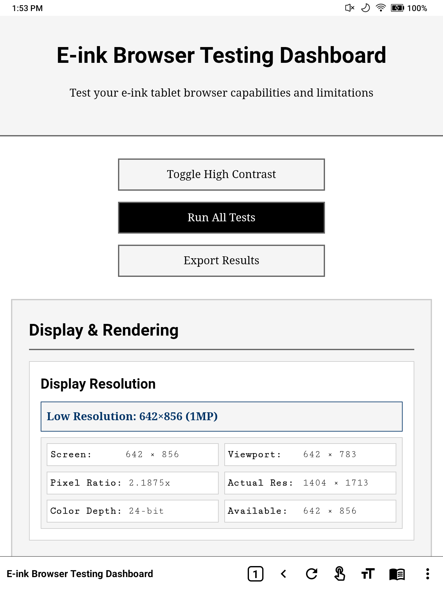
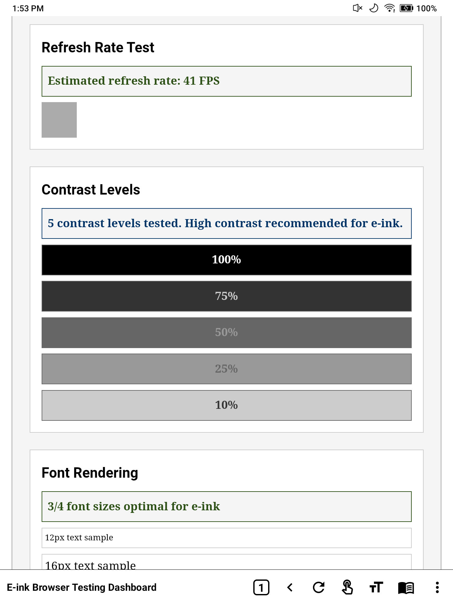
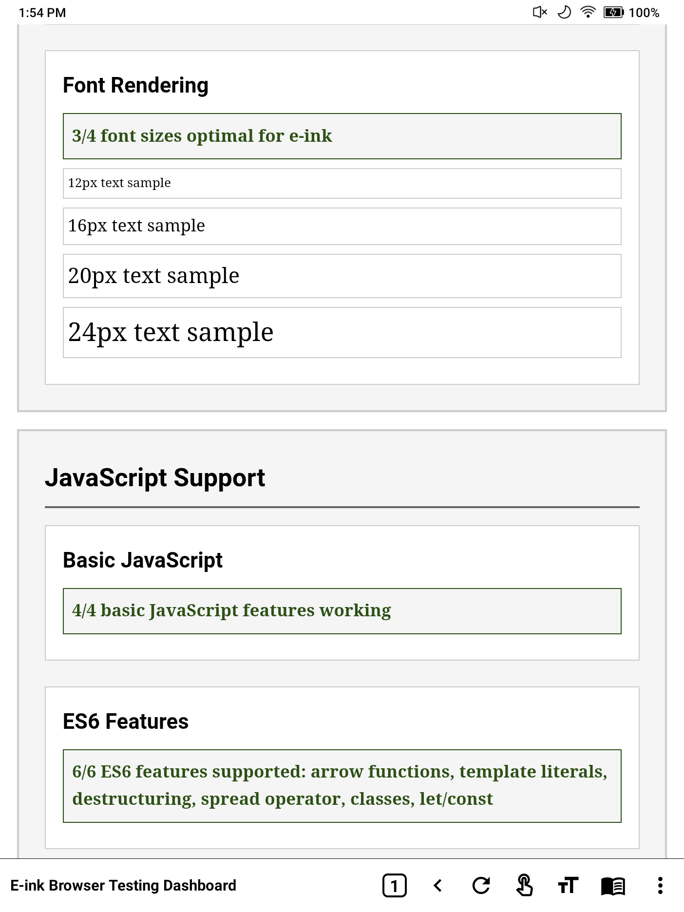
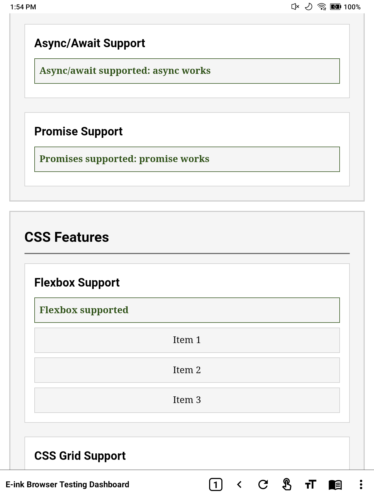
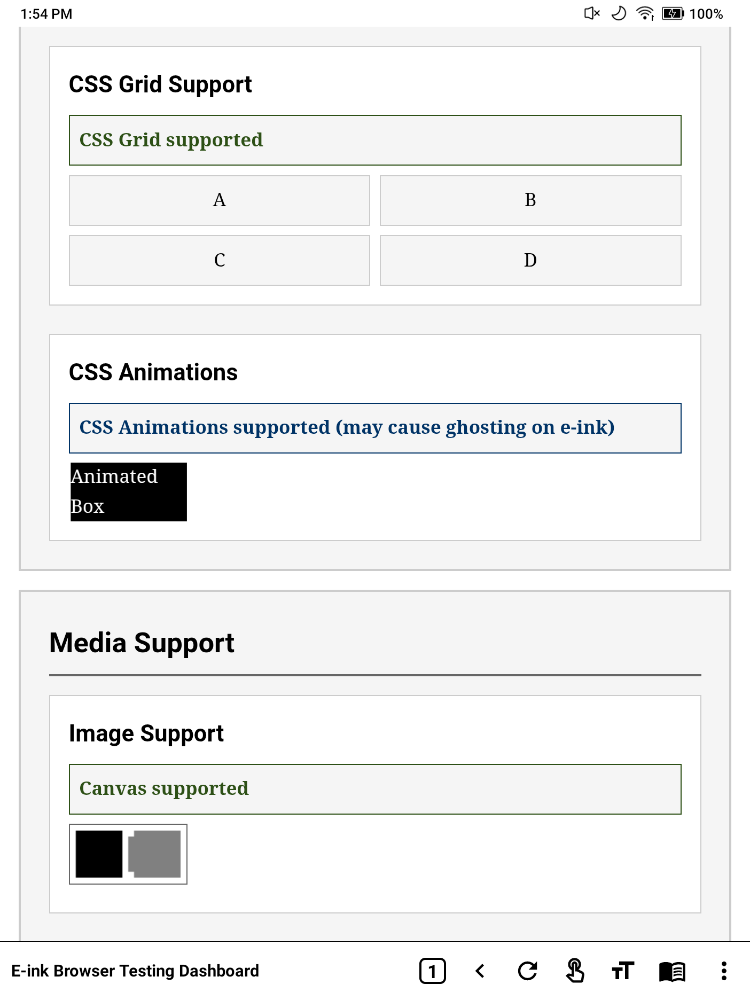
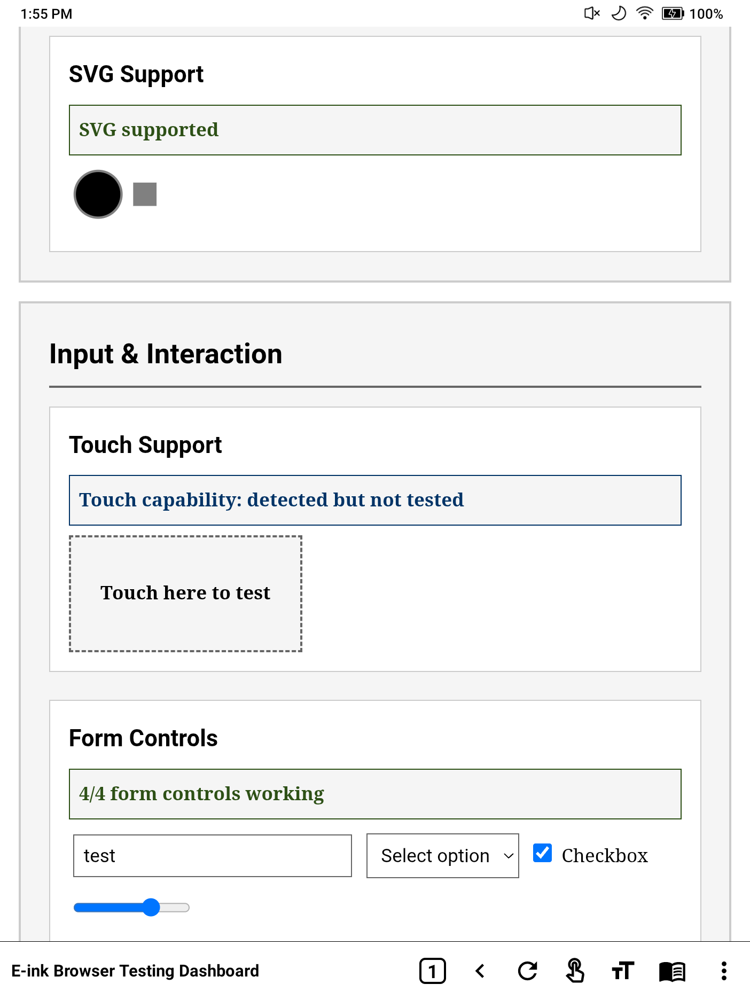
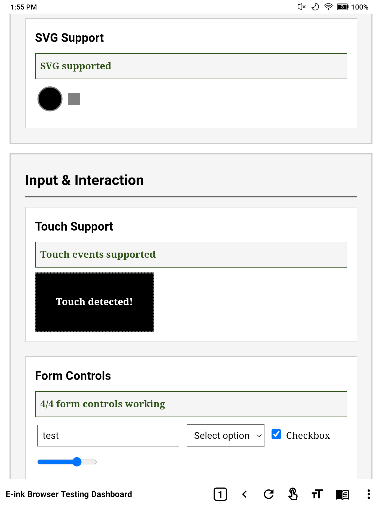
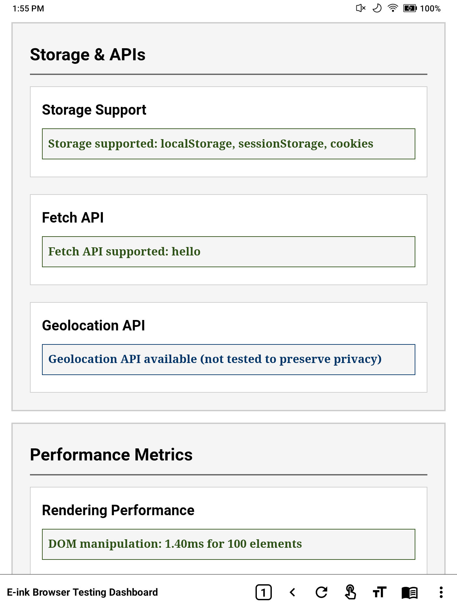
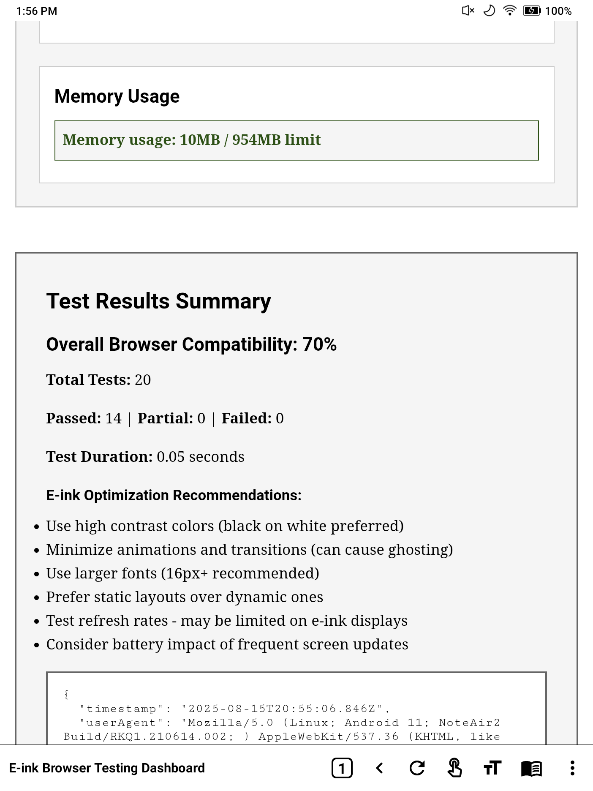

# E-ink Browser Testing Dashboard

A comprehensive web-based testing suite designed specifically for e-ink tablets and displays. This tool helps you understand the capabilities and limitations of your e-ink device's browser.

  

## 🚀 Quick Start

### Option 1: Local Development Server
```bash
git clone https://github.com/alexchambers/e-ink-dashboard.git
cd e-ink-dashboard
node server.js
```

### Option 2: Static File Serving
Simply open `index.html` in any modern browser - no server required!

## 📱 Network Access
The Node.js server automatically detects your local IP and makes the dashboard accessible from other devices on your network - perfect for testing e-ink tablets!

## 📸 Screenshots (Boox Note Air 2)

<details>
<summary>Click to view screenshot gallery from a real e-ink tablet</summary>

### Dashboard Overview & Resolution Detection

*Main dashboard showing the resolution detection feature displaying 642×856 screen with 2.1875x pixel ratio*

### Display & Rendering Tests

*Refresh rate test (41 FPS), contrast levels, and font rendering samples*

### JavaScript Support Detection

*Complete ES6 feature support including arrow functions, template literals, destructuring, spread operator, classes, and let/const*

### CSS Features Testing

*Flexbox and CSS Grid support with animation testing (with e-ink ghosting warning)*

### Media Support Analysis

*Canvas and SVG rendering capabilities on e-ink display*

### Input & Interaction Testing

*Touch capability detection and form controls testing*

### Touch Events Confirmed

*Touch event successfully detected and working on the Boox Note Air 2*

### Storage & Web APIs

*Full support for localStorage, sessionStorage, cookies, Fetch API, and Geolocation API*

### Performance & Test Summary

*70% browser compatibility with detailed performance metrics and e-ink optimization recommendations*

</details>

## Features

### 🖥️ Display & Rendering Tests
- **Resolution Detection**: Complete display resolution analysis with viewport info
- **Refresh Rate Detection**: Measures actual refresh rates and frame rendering
- **Contrast Level Testing**: Tests 5 different contrast levels for optimal readability
- **Font Rendering**: Tests multiple font sizes optimized for e-ink displays
- **High Contrast Mode**: Toggle between normal and high contrast themes

### 🔧 JavaScript & Web API Support
- **Basic JavaScript**: Core language features and operations
- **ES6 Features**: Modern JavaScript syntax support
- **Async/Await**: Asynchronous programming capabilities
- **Promise Support**: Promise-based operation testing
- **Storage APIs**: LocalStorage, SessionStorage, and Cookie support
- **Fetch API**: Network request capabilities
- **Geolocation**: Location services availability (privacy-safe testing)

### 🎨 CSS Feature Detection
- **Flexbox Support**: Modern flexible layout system
- **CSS Grid**: Advanced grid layout capabilities
- **CSS Animations**: Animation support (with e-ink considerations)
- **Media Queries**: Responsive design capabilities

### 📱 Input & Interaction
- **Touch Support**: Touch event detection and handling
- **Form Controls**: Text inputs, selects, checkboxes, and range sliders
- **Gesture Recognition**: Basic touch gesture support

### 🖼️ Media Support
- **Canvas Rendering**: 2D graphics and drawing capabilities
- **SVG Support**: Scalable vector graphics rendering
- **Image Processing**: Image display and manipulation

### ⚡ Performance Metrics
- **Rendering Performance**: DOM manipulation speed tests
- **Memory Usage**: JavaScript heap size monitoring (when available)
- **Battery Impact**: Performance considerations for e-ink devices

## Quick Start

1. **Open in Browser**: Simply open `index.html` in your e-ink tablet's browser
2. **Run Tests**: Click "Run All Tests" to execute the complete test suite
3. **View Results**: Each test shows pass/fail/partial status with detailed information
4. **Export Data**: Download your results as JSON for future reference

## Understanding Results

### Status Indicators
- **✅ Pass**: Feature works fully as expected
- **⚠️ Partial**: Feature works with limitations
- **❌ Fail**: Feature not supported or not working
- **ℹ️ Info**: Informational result or optional feature

### E-ink Specific Considerations

#### Refresh Rates
E-ink displays typically have much slower refresh rates (1-10 FPS) compared to LCD screens (60+ FPS). The dashboard tests and reports actual performance.

#### Animations
CSS animations and transitions may cause "ghosting" effects on e-ink displays. The test suite identifies animation support but recommends minimal use.

#### Contrast
E-ink displays excel at high contrast black-and-white content. The tool includes a high contrast mode toggle specifically for testing optimal visibility.

#### Battery Life
E-ink displays consume significantly less power when displaying static content. Frequent updates can impact battery life.

## Browser Compatibility

This tool is designed to work on:
- Android WebView browsers on e-ink tablets
- Chrome/Chromium-based browsers
- Firefox mobile
- Samsung Internet
- Other modern mobile browsers

## Test Categories

### 1. Display Tests
Tests rendering capabilities, refresh rates, and visual quality specific to e-ink technology.

### 2. JavaScript Engine
Comprehensive JavaScript feature detection from basic operations to modern ES6+ features.

### 3. CSS Layout
Tests modern CSS layout systems and styling capabilities.

### 4. Media Handling
Evaluates image, vector graphics, and canvas rendering support.

### 5. User Interaction
Tests touch, gesture, and form input capabilities.

### 6. Web APIs
Checks availability of modern browser APIs for storage, networking, and device features.

### 7. Performance
Measures rendering speed and resource usage with e-ink considerations.

## Manual Testing Features

The dashboard includes several manual testing utilities accessible via the browser console:

```javascript
// Force a display refresh test
testUtils.forceRefresh();

// Test scrolling performance
testUtils.testScrolling();

// Check battery status (if supported)
testUtils.testBattery();

// Access raw test results
getBrowserTestResults();
```

## Interpreting E-ink Results

### Expected Limitations
- **Low Refresh Rates**: 1-10 FPS is normal for e-ink
- **Animation Issues**: May cause ghosting or poor performance
- **Color Limitations**: Grayscale or limited color palette
- **Slower Rendering**: DOM updates may be visibly slower

### Optimization Recommendations
Based on test results, the dashboard provides specific recommendations:

1. **Use High Contrast**: Black text on white backgrounds
2. **Larger Fonts**: 16px+ for better readability
3. **Minimize Animations**: Static layouts perform better
4. **Optimize Images**: High contrast, simple graphics work best
5. **Reduce Updates**: Batch DOM changes to minimize refreshes

## File Structure

```
e-ink-dashboard/
├── index.html          # Main testing interface
├── style.css           # E-ink optimized styles
├── script.js           # Testing logic and feature detection
└── README.md           # This documentation
```

## Customization

### Adding New Tests
To add custom tests, extend the `EInkBrowserTester` class:

```javascript
// Add to script.js
testCustomFeature() {
    try {
        // Your test logic here
        this.logResult('customTest', 'Custom test result', 'pass');
    } catch (error) {
        this.logResult('customTest', `Error: ${error.message}`, 'fail');
    }
}
```

### Styling for Your Device
Modify CSS variables in `style.css` to optimize for your specific e-ink display:

```css
:root {
    --bg-primary: #ffffff;      /* Background color */
    --text-primary: #000000;    /* Text color */
    --border-dark: #666666;     /* Border color */
}
```

## Data Export

Test results can be exported as JSON containing:
- Complete test results with timestamps
- Device information (user agent, viewport)
- Performance metrics
- Summary statistics

This data can be used for:
- Comparing different browsers
- Tracking performance over time
- Sharing compatibility information
- Development optimization decisions

## Troubleshooting

### Tests Not Running
1. Ensure JavaScript is enabled
2. Check browser console for errors
3. Try refreshing the page
4. Test individual features manually

### Poor Performance
1. Close other browser tabs
2. Ensure device has sufficient battery
3. Check available memory
4. Try high contrast mode

### Display Issues
1. Try zooming to different levels
2. Test both portrait and landscape orientations
3. Toggle high contrast mode
4. Check screen brightness settings

## Privacy & Security

This testing tool:
- ✅ Runs entirely locally (no network requests except for fetch API testing)
- ✅ Does not collect or transmit personal data
- ✅ Uses privacy-safe feature detection
- ✅ Can be used offline after initial load

The only network activity is:
- Loading the initial page
- Testing fetch API with data URLs only
- Geolocation is detected but not accessed

## License

This project is open source and available for modification and distribution.

## Contributing

Feel free to submit improvements, additional tests, or e-ink specific optimizations.

---

**Happy Testing!** 🖥️📱

Use this dashboard to understand your e-ink tablet's browser capabilities and optimize your web applications accordingly.